# HedgeFi

**A fixed-rate credit terminal for on-chain lending, interest-rate hedging, and delivery-versus-payment settlement.**

HedgeFi is a full-stack DeFi protocol built for Ethereum Sepolia. It combines three products that normally live in separate applications into one trading-terminal interface:

1. **An over-collateralised lending market** — deposit USDC to earn yield, lock ETH as collateral to borrow USDC at a utilisation-driven variable rate.
2. **An interest-rate swap desk** — take the fixed or floating side of a rate swap to hedge the borrow rate you just took on, with periodic netted cash settlement.
3. **A delivery-versus-payment settlement engine** — atomically exchange two assets between two parties through escrow, so neither side can walk away mid-trade.

Everything the interface shows is read from live contracts. There is no mock data path in the UI: balances, rates, loan health, and swap positions are all `eth_call` results, and the single external market feed is labelled as such at all times.

---

## Table of contents

- [The problem it solves](#the-problem-it-solves)
- [Repository layout](#repository-layout)
- [System architecture](#system-architecture)
- [Contract catalogue](#contract-catalogue)
- [Deployment wiring](#deployment-wiring)
- [Core flows](#core-flows)
- [State machines](#state-machines)
- [The math](#the-math)
- [Off-chain keepers](#off-chain-keepers)
- [The frontend](#the-frontend)
- [Getting started](#getting-started)
- [Environment reference](#environment-reference)
- [Testing](#testing)
- [Troubleshooting and known API issues](#troubleshooting-and-known-api-issues)
- [Known limitations](#known-limitations)

---

## The problem it solves

A borrower in a conventional DeFi money market faces two risks at once. The first is **price risk**: if their collateral falls in value, their position is liquidated. The second is **rate risk**: the borrow rate on a utilisation-based market is variable, so a quiet 4% loan becomes a 25% loan the moment other users drain the pool toward full utilisation.

Traditional finance separates these. You borrow from a bank at a floating rate, then buy an interest-rate swap from a dealer to convert that floating exposure into a fixed cost. HedgeFi puts both legs in the same protocol: you borrow on the `LendingPool`, then open an offsetting swap on the `SwapEngine`, and the terminal shows your combined effective rate. The DvP engine exists because once you have two counterparties owing each other assets, you need settlement that cannot half-execute.

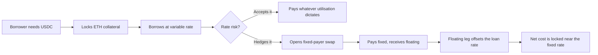

---

## Repository layout

```
hedgefi/
├── smart-contracts/          Foundry project — Solidity 0.8.24
│   ├── src/
│   │   ├── lending/          LendingPool, LoanManager, InterestRateModel, CollateralVault
│   │   ├── liquidation/      LiquidationEngine
│   │   ├── swaps/            SwapEngine, SwapFactory, SettlementEngine, NettingEngine
│   │   ├── settlement/       DvPEngine, EscrowManager
│   │   ├── tokenization/     LoanNFT, SwapNFT, PositionRegistry
│   │   ├── governance/       Governance — role + parameter registry
│   │   ├── libraries/        InterestMath, HealthFactor, SwapMath
│   │   ├── oracle/           PriceOracle — generic stub, not deployed
│   │   └── mocks/            MockUSDC, MockPriceOracle
│   ├── script/Deploy.s.sol   One-shot deploy + wiring script
│   ├── test/                 Forge tests by domain
│   └── foundry.toml          via_ir = true, solc 0.8.24
│
├── bots/                     Python keepers — web3.py
│   ├── config.py             Env loading, address book, shared constants
│   ├── contracts.py          ABI loading + contract handles
│   ├── utils.py              Tx building, signing, receipt waiting
│   ├── oracle_keeper.py      Pushes CoinGecko ETH/USD on-chain
│   ├── settlement_keeper.py  Settles swaps whose period has elapsed
│   ├── liquidation_keeper.py Liquidates loans with health factor < 1
│   ├── scheduler.py          Supervises all three, restarts on crash
│   └── scanner.py            Read-only protocol state dump
│
├── frontend/                 Create React App + TypeScript
│   ├── src/
│   │   ├── AppShell.tsx      Header, side rail, router
│   │   ├── App.css           The entire terminal theme
│   │   ├── pages/            Dashboard, Lend, Borrow, Hedge, Marketplace, Portfolio, Admin
│   │   ├── components/       StatCharts (candles, donut, gauges), panels
│   │   ├── hooks/            useProtocol, useWallet, useEthOhlc
│   │   ├── config/           Chain config, contract addresses, ABIs
│   │   └── abis/             JSON ABIs copied from Foundry output
│   └── package.json
│
└── docs/                     Short design notes
```

---

## System architecture

Three layers. The contracts are the source of truth; the keepers are the only writers that act without a user; the frontend never writes state except through a connected wallet.

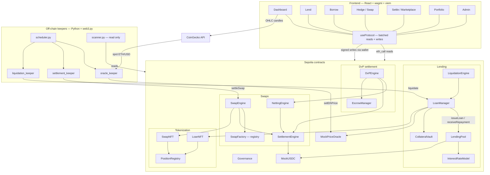

Two things about this diagram are worth stating plainly because they are easy to misread:

**`Governance` has no arrows.** It holds roles and a parameter struct, but no other contract reads it. See [Known limitations](#known-limitations).

**The Dashboard talks to CoinGecko directly, and so does the oracle keeper.** They deliberately share one price source so the chart and the on-chain oracle do not tell different stories. The browser uses the keyless public endpoint; the API key lives only in the bot's environment and is never bundled into client-side JavaScript.

---

## Contract catalogue

### Lending

| Contract | Responsibility |
|---|---|
| `LendingPool` | The USDC vault and lender entry point. `deposit` / `withdraw` for lenders. Exposes `issueLoan` and `receiveRepayment`, callable only by the registered `LoanManager`, so borrowed USDC leaves the pool only through vetted loan logic. Tracks `totalDeposits` and `totalBorrows`, the two inputs to the rate model, and surfaces `availableLiquidity` and `currentBorrowRateBps`. |
| `LoanManager` | The borrower entry point and the loan ledger: `borrow`, `repay`, `liquidate`, plus the views `collateralValueUsdc`, `debtOf`, `ltvBps`, `healthFactorBps`, `maxBorrowable`, `isLiquidatable`. Holds the authoritative risk constants. |
| `InterestRateModel` | Pure math. Maps utilisation to a borrow rate through a two-slope kinked curve. Owner-settable parameters. |
| `CollateralVault` | Holds nothing but ETH. `depositFor` / `withdrawTo` are `onlyOwner`, and the owner is `LoanManager`, so collateral can only move as a side effect of a loan action. `ReentrancyGuard` on both. |
| `LiquidationEngine` | A thin `onlyOwner`-configurable façade over `LoanManager.liquidate`, so liquidation permissions can be rotated without touching loan storage. |

### Swaps

| Contract | Responsibility |
|---|---|
| `SwapEngine` | User entry point. `openSwap` validates terms and delegates storage to `SwapFactory`, mints the position NFT, and links it to the loan. `settleSwap` drives a period settlement. |
| `SwapFactory` | The swap registry. Stores the `Swap` struct — `loanTokenId`, `fixedPayer`, `floatingPayer`, `notionalUsdc`, `fixedRateBps`, `startTime`, `maturityTime`, `settlementInterval`, `lastSettlementTime` — plus `loanToSwap` and an `activeSwapIds` array with swap-and-pop removal. Enforces one swap per loan. |
| `SettlementEngine` | The settlement record book. `recordSettlement` writes a `Pending` obligation for a swap period; `markExecuted` and `cancelSettlement` close it; `getSettlementsForSwap` and `pendingSettlementsForSwap` are the read side. It never moves funds itself. |
| `NettingEngine` | Reads every pending settlement for a swap and collapses them into a single `NetObligation { payer, payee, amountUsdc }`, so a series of small periodic flows becomes one payment. |

### Tokenization

| Contract | Responsibility |
|---|---|
| `LoanNFT` | ERC-721. One token per loan, minted by `LoanManager` only, burned on repay. Carries `LoanMetadata` so a loan is transferable and inspectable as an object. |
| `SwapNFT` | ERC-721. One token per swap position, minted by `SwapEngine` only. |
| `PositionRegistry` | The join table. `linkPosition(loanTokenId, swapTokenId)` and `hasActiveHedge(loanTokenId)` let the protocol and the UI answer "is this loan hedged?" in one call. |

### Settlement

| Contract | Responsibility |
|---|---|
| `DvPEngine` | Delivery versus payment. `executeSettlement(settlementId)` asks `NettingEngine` for the net obligation, locks it from the payer, releases it to the payee, and marks the settlement executed — all in one transaction, so it cannot half-complete. |
| `EscrowManager` | Custody for USDC. Users `deposit` / `withdraw` freely, but `lock`, `release` and `refund` are callable only by `DvPEngine`. |

### Support

| Contract | Responsibility |
|---|---|
| `Governance` | `AccessControl` + `Pausable`. Defines `GOVERNOR_ROLE` and `KEEPER_ROLE` and stores the protocol parameter struct. Advisory only today. |
| `MockPriceOracle` | The ETH/USD feed. 8-decimal Chainlink-style price, seeded at `4000 * 1e8`, updated by the oracle keeper via `setEthPrice`. |
| `MockUSDC` | 6-decimal ERC-20 with a faucet, standing in for real USDC on Sepolia. |
| `PriceOracle` | A 10-line generic `bytes32 symbol → price` stub with no access control. Not deployed, not wired, not used — `MockPriceOracle` is the live feed. |

---

## Deployment wiring

`script/Deploy.s.sol` deploys everything in dependency order and then performs the setter calls that connect them. The wiring matters more than the deployment: most contracts start inert and only become usable once their counterpart address is set, and several transfer ownership so that a privileged function can only be reached through the intended caller.

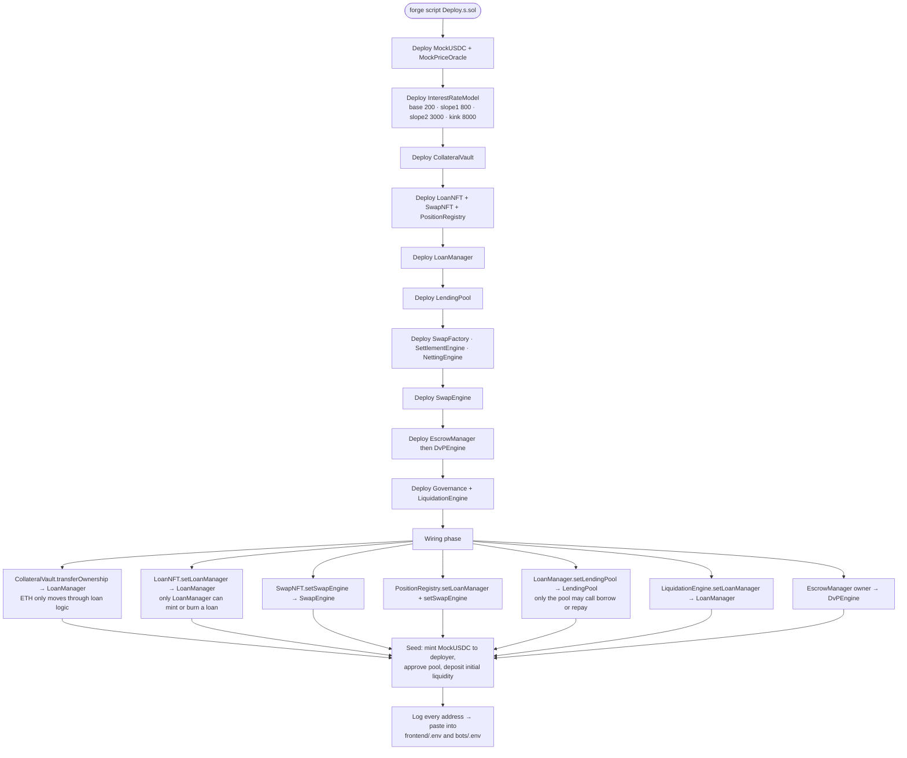

---

## Core flows

### 1. Lending — supply USDC

The simplest path. The lender approves the pool, deposits, and their share of the pool starts earning the borrow rate that borrowers pay.

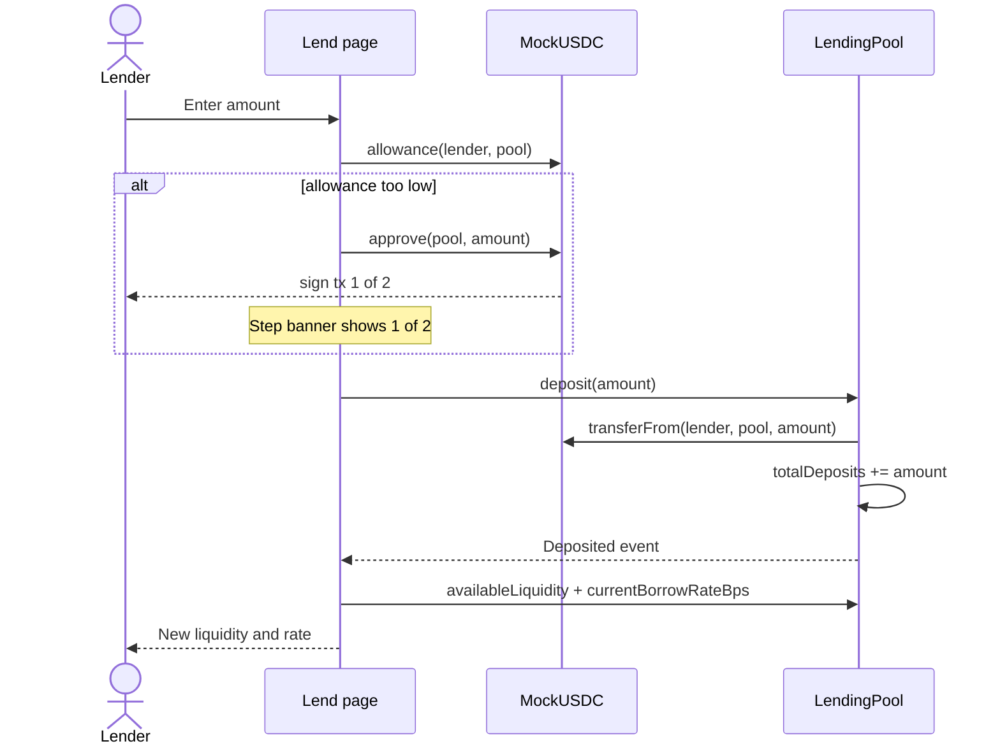

The two-step approve-then-deposit is why the shell renders a `Step 1 of 2` banner: ERC-20 approval and the deposit are separate signatures, and the UI runs the second automatically once the first confirms.

### 2. Borrowing — lock ETH, draw USDC

`LoanManager.borrow` is payable: the ETH collateral arrives with the same call that creates the debt, so there is no window in which a loan exists uncollateralised.

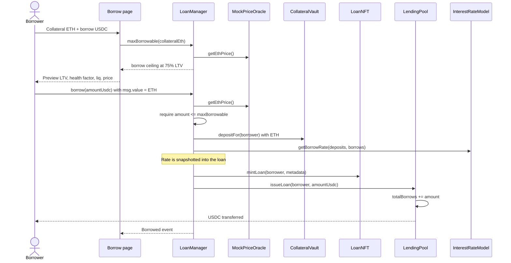

The rate is captured at origination. That snapshot is the whole reason the swap desk exists — see the hedge flow next.

### 3. Hedging — open an interest-rate swap against a loan

One swap per loan, enforced by `SwapFactory.loanToSwap`. The position is minted as an NFT and linked to the loan in `PositionRegistry`, so `hasActiveHedge(loanTokenId)` becomes true.

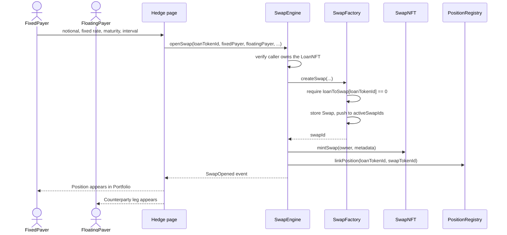

### 4. Settlement — periodic netted cash flow through DvP

This is the most layered path in the protocol, and the layering is deliberate: **computing** an obligation, **netting** obligations, and **moving money** are three separate contracts, so the atomic-exchange guarantee lives in exactly one place.

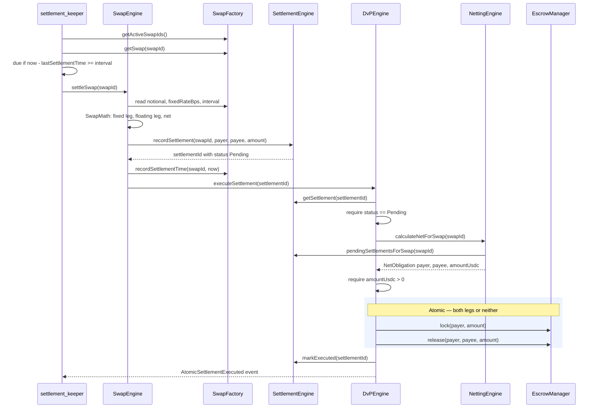

If any `require` in that block fails, the whole transaction reverts and the escrow lock unwinds with it. There is no state in which the payer's funds are locked but the payee was never paid.

### 5. Liquidation — when health factor drops below 1

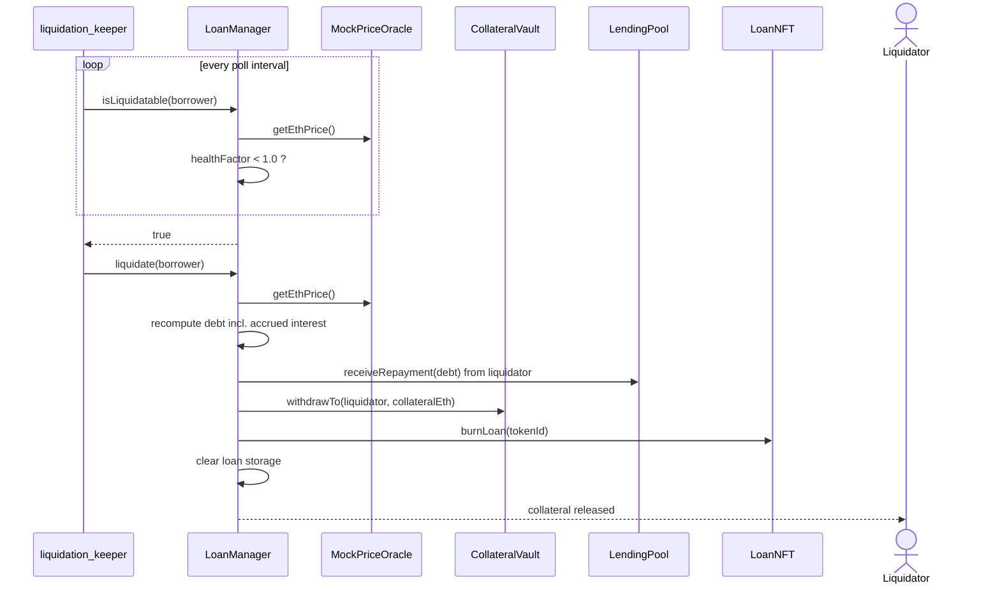

---

## State machines

A loan and a swap each have a small, strict lifecycle. Nothing skips a state.

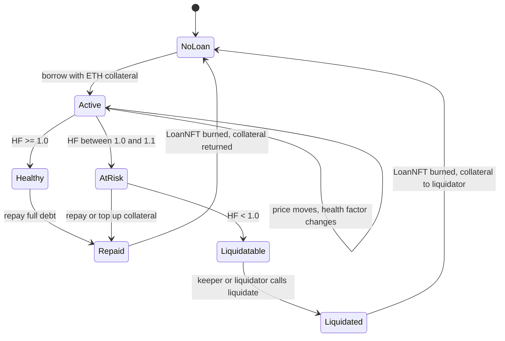

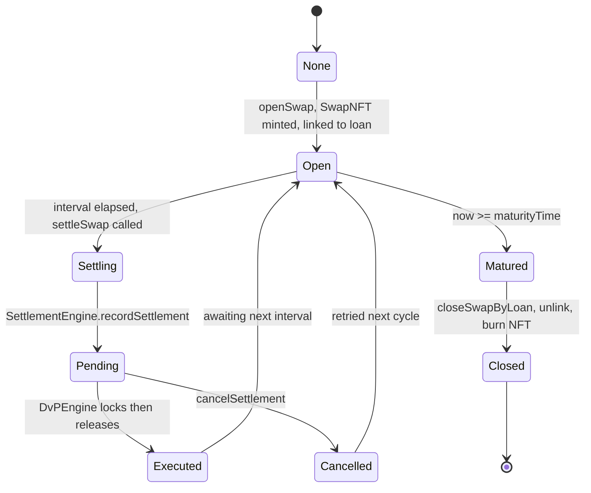

---

## The math

Every formula below is written the way the contract computes it, with integer division in the same order as the Solidity. That ordering is not cosmetic: `(a * b) / c` and `a * (b / c)` give different answers in integer arithmetic, and the multiply-first convention is what keeps precision.

### Units and decimals

Mixing three different fixed-point scales is the single largest source of confusion in this codebase, so here they are in one place.

| Quantity | Decimals | `1.0` looks like | Where it comes from |
|---|---|---|---|
| ETH / collateral | 18 | `1e18` | `msg.value` |
| USDC / debt | 6 | `1e6` | `MockUSDC` |
| Oracle price | 8 | `1e8` | `MockPriceOracle`, Chainlink convention |
| Rates | basis points | `10_000` | `BPS` constant |
| Ratios | WAD | `1e18` | `WAD` constant in `HealthFactor` |

```
BPS  = 10_000          // 100.00%
WAD  = 1e18            // 1.0 as a ratio
YEAR = 365 days        // 31_536_000 seconds
```

The two conversions used constantly:

```
// ETH amount (18dp) × price (8dp) → USD value (8dp)
usdValue8 = (collateralEth * ethPrice) / 1e18

// USD value (8dp) → USDC amount (6dp), and back
usdcAmount6 = usdValue8 / 100
usdValue8   = usdcAmount6 * 100
```

That `/ 100` and `* 100` appear all over `LoanManager` and `HealthFactor`. They are not fees or percentages — they are purely the 8-decimal to 6-decimal shift.

### 1. Utilisation

How much of the pool is lent out. This is the only input the rate model needs.

```
                    totalBorrows × BPS
utilizationBps  =  ────────────────────        (0 if totalDeposits == 0)
                      totalDeposits
```

### 2. The interest-rate model — a two-slope kinked curve

`InterestRateModel.sol`. Below the kink the rate rises gently to keep borrowing cheap while there is spare liquidity. Above the kink it rises steeply, because the pool is running out of money and lenders need to be paid to stay while borrowers need a reason to leave.

```
if utilizationBps <= kinkBps:

                             utilizationBps × slope1Bps
    borrowRateBps = baseRateBps + ──────────────────────────
                                        kinkBps

else:

    excess = utilizationBps − kinkBps

                                             excess × slope2Bps
    borrowRateBps = baseRateBps + slope1Bps + ───────────────────
                                                BPS − kinkBps
```

Deployed defaults, and what they mean:

| Parameter | Value | Meaning |
|---|---|---|
| `baseRateBps` | 200 | 2% floor — the rate at zero utilisation |
| `slope1Bps` | 800 | +8% earned across the whole pre-kink range |
| `slope2Bps` | 3000 | +30% earned across the short post-kink range |
| `kinkBps` | 8000 | The elbow sits at 80% utilisation |

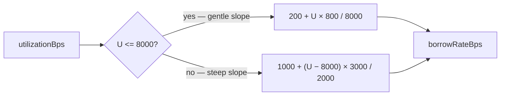

Worked points on the curve:

| Utilisation | Computation | Borrow APR |
|---|---|---|
| 0% | `200 + 0` | **2.00%** |
| 40% | `200 + 4000×800/8000` | **6.00%** |
| 80% — the kink | `200 + 8000×800/8000` | **10.00%** |
| 90% | `1000 + 1000×3000/2000` | **25.00%** |
| 100% | `1000 + 2000×3000/2000` | **40.00%** |

The maximum possible rate is `base + slope1 + slope2 = 200 + 800 + 3000 = 4000 bps`, which is where the Dashboard's `MAX APR 40.00%` label comes from. Notice the asymmetry: the first 80% of utilisation buys 8 points of rate, the last 20% buys 30. That steepness is the mechanism that makes a variable borrow rate genuinely risky — and therefore worth hedging.

### 3. Interest accrual

`InterestMath.sol`. This is **simple interest, not compounding.** Interest is a function of elapsed wall-clock time against the original principal; it is never folded back into the principal.

```
                principal × annualRateBps × elapsedSeconds
interest  =  ───────────────────────────────────────────────
                             BPS × YEAR

totalDebt =  principal + interest
```

Two consequences worth internalising. First, calling `repay` twice in the same block costs the same as calling it once — there is no per-block compounding to race. Second, the rate stored on the loan is the rate snapshotted at origination, so a borrower's cost does **not** change when pool utilisation changes afterwards. Utilisation moves the rate for the *next* borrower.

### 4. Collateral valuation

```
// 8-decimal USD, used by HealthFactor
collateralValueUsd  = (collateralEth × ethPrice) / 1e18

// 6-decimal USDC, used by LoanManager views and the UI
collateralValueUsdc = (collateralEth × ethPrice) / 1e18 / 100
```

### 5. Borrow limit

The collateral factor caps how much of your collateral you may draw against. At 7500 bps you can borrow 75 cents of USDC per dollar of ETH.

```
                 (collateralEth × ethPrice / 1e18) × COLLATERAL_FACTOR_BPS
maxBorrowable = ───────────────────────────────────────────────────────────
                                    BPS × 100
```

### 6. Loan-to-value

```
           debtUsdc × BPS
ltvBps = ──────────────────────
         collateralValueUsdc
```

### 7. Health factor — two implementations

This is the number that decides whether you get liquidated. The codebase computes it in two different scales, and knowing which one you are reading matters.

**`LoanManager.healthFactorBps`** — basis points, `10_000` means exactly 1.0:

```
                    collateralValueUsdc × LIQUIDATION_THRESHOLD_BPS
healthFactorBps = ─────────────────────────────────────────────────
                                    debtUsdc
```

**`HealthFactor.calculate`** — WAD, `1e18` means exactly 1.0:

```
adjustedCollateral = (collateralValueUsd × liquidationThresholdBps) / BPS
debtUsd            = debtUsdc × 100

                     adjustedCollateral × WAD
healthFactor    =  ───────────────────────────
                            debtUsd

isLiquidatable  =  healthFactor < WAD
```

Both express the same quantity: *risk-adjusted collateral divided by debt*. Above 1.0 the loan is solvent. Below 1.0 anyone may liquidate it. When debt is zero the health factor is treated as effectively infinite rather than dividing by zero.

The gap between the two constants is the borrower's entire safety margin:

| Constant | Value | Role |
|---|---|---|
| `COLLATERAL_FACTOR_BPS` | 7500 | The most you may borrow — 75% LTV |
| `LIQUIDATION_THRESHOLD_BPS` | 8000 | Where you get liquidated — 80% LTV |
| `LIQUIDATION_BONUS_BPS` | 500 | 5% incentive intended for liquidators |

### 8. Liquidation price — derived, not stored

Nowhere in the contracts is a liquidation price written down. The UI derives it by solving the health-factor equation for the price at which `healthFactorBps` hits exactly `10_000`:

```
Set  collateralValueUsdc × LIQ_THRESHOLD_BPS = debtUsdc × BPS

                       debtUsdc × BPS
=>   P_liq  =  ──────────────────────────────────
                collateralEth × LIQ_THRESHOLD_BPS
```

Equivalently: **liquidation happens when collateral value falls below 1.25× the debt** (because `10000 / 8000 = 1.25`).

Worked example, 1 ETH of collateral at $2,382:

```
collateralValueUsdc = 1 × 2382          = 2,382.00 USDC
maxBorrowable       = 2382 × 0.75       = 1,786.50 USDC
healthFactorBps     = 2382 × 8000 / 1786.50 = 10,666  → HF 1.067
P_liq               = 1786.50 × 10000 / (1 × 8000) = $2,233.125
```

So a borrower who draws the absolute maximum is liquidated on a **6.25%** adverse move. That figure is fixed by the ratio of the two constants and is independent of price or position size:

```
max drawdown at full LTV = 1 − 7500/8000 = 6.25%
```

More generally, if you borrow to an opening LTV of `ltv0` (in bps), your buffer is:

```
priceDropToLiquidation = 1 − ltv0 / LIQUIDATION_THRESHOLD_BPS
```

Borrow at 50% LTV instead of 75% and the buffer widens from 6.25% to 37.5%. This is the single most useful number for a borrower to look at, which is why the Borrow page previews it before you sign.

### 9. Liquidation seizure

The intended behaviour is that a liquidator repays the debt and receives the equivalent collateral plus a 5% bonus:

```
debtInEth            = (debtUsdc × 100 × 1e18) / ethPrice
bonus                = (debtInEth × LIQUIDATION_BONUS_BPS) / BPS
collateralToLiquidator = debtInEth + bonus

// safety clamp
if collateralToLiquidator > collateral:
    collateralToLiquidator = collateral
```

See [Known limitations](#known-limitations) — in the current implementation that clamp always fires, so the bonus is never actually paid.

### 10. Interest-rate swap legs

`SwapMath.sol`. Both legs are the same shape; only the rate differs. The fixed rate is agreed at open and stored on the swap; the floating rate is read from the pool at settlement time.

```
                    notional × fixedRateBps × periodSeconds
fixedPayment    = ──────────────────────────────────────────
                                BPS × YEAR

                    notional × floatingRateBps × periodSeconds
floatingPayment = ─────────────────────────────────────────────
                                BPS × YEAR
```

Settlement nets the two so only the difference changes hands:

```
if fixedPayment > floatingPayment:
    amount    = fixedPayment − floatingPayment
    direction = FloatingPayerReceives

if floatingPayment > fixedPayment:
    amount    = floatingPayment − fixedPayment
    direction = FixedPayerReceives

else:
    amount    = 0
    direction = NoPayment
```

Read that carefully, because the direction is the easy thing to get backwards: the fixed payer *receives* when floating exceeds fixed. That is exactly the hedge a borrower wants. Their loan cost rose with the floating rate, and the swap pays them the difference.

Worked example — $100,000 notional, 30-day period, fixed 10%, floating settles at 25%:

```
fixedPayment    = 100000 × 1000 × 2592000 / (10000 × 31536000) =   821.92 USDC
floatingPayment = 100000 × 2500 × 2592000 / (10000 × 31536000) = 2,054.79 USDC
net             = 2054.79 − 821.92                             = 1,232.87 USDC
direction       = FixedPayerReceives
```

The borrower pays 821.92 on the swap and collects 2,054.79, netting 1,232.87 in their favour — which is close to what the utilisation spike added to their loan interest over the same period. That is the hedge working.

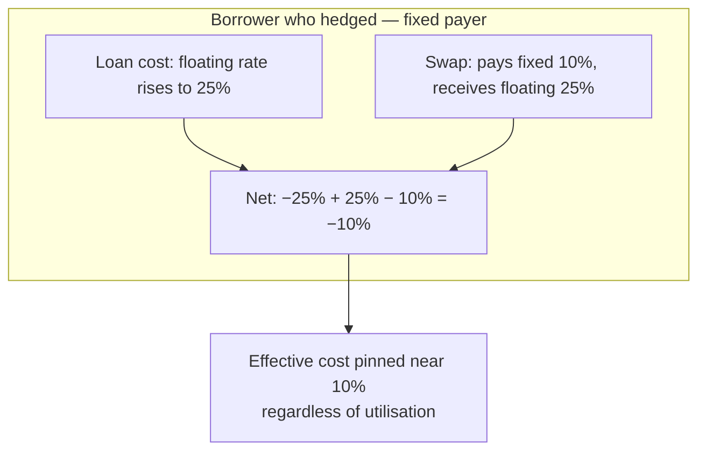

### 11. DV01 — sensitivity

The change in a leg's value per one-basis-point move in rates. It is the derivative of the payment formula with respect to the rate, so the rate drops out:

```
          notional × periodSeconds
dv01 = ─────────────────────────────
              BPS × YEAR
```

Because it does not depend on the rate itself, DV01 for these swaps is a constant for a given notional and period — a convenient property of the simple-interest convention.

### 12. Remaining periods

```
remainingPeriods = (maturityTime − currentTime) / settlementInterval
```

Integer division, so a partial period is truncated. Zero once past maturity.

### 13. Oracle deadband

The oracle keeper does not push every tick. Gas is only spent when the price has moved enough to matter:

```
              | newPrice − currentPrice |
changeBps = ───────────────────────────── × 10_000
                    currentPrice

push on-chain only if changeBps >= ORACLE_MIN_CHANGE_BPS   (default 25 = 0.25%)

newPriceScaled = int(marketPrice × 1e8)
```

If the current on-chain price is zero the change is treated as infinite so the first write always lands.

### Quick reference

| Quantity | Formula | Scale |
|---|---|---|
| Utilisation | `borrows × 10000 / deposits` | bps |
| Borrow rate, below kink | `base + U × slope1 / kink` | bps |
| Borrow rate, above kink | `base + slope1 + (U − kink) × slope2 / (10000 − kink)` | bps |
| Interest | `principal × rate × elapsed / (10000 × YEAR)` | USDC 6dp |
| Total debt | `principal + interest` | USDC 6dp |
| Collateral value | `eth × price / 1e18 / 100` | USDC 6dp |
| Max borrowable | `eth × price / 1e18 × 7500 / 10000 / 100` | USDC 6dp |
| LTV | `debt × 10000 / collateralValue` | bps |
| Health factor | `collateralValue × 8000 / debt` | bps, 10000 = 1.0 |
| Liquidation price | `debt × 10000 / (eth × 8000)` | USD |
| Buffer to liquidation | `1 − ltv0 / 8000` | fraction |
| Swap leg | `notional × rate × period / (10000 × YEAR)` | USDC 6dp |
| Net settlement | `abs(fixed − floating)` | USDC 6dp |
| DV01 | `notional × period / (10000 × YEAR)` | USDC 6dp |
| Oracle deadband | `abs(new − cur) / cur × 10000` | bps |

---

## Off-chain keepers

Three things in this protocol need doing on a schedule, and no user has an incentive to do them reliably: the oracle needs fresh prices, matured swap periods need settling, and unhealthy loans need liquidating. `scheduler.py` runs all three as supervised subprocesses and restarts any that dies.

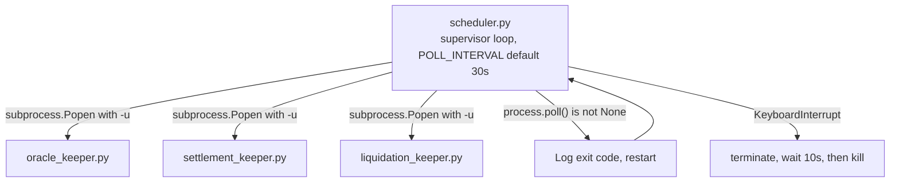

### oracle_keeper.py

The only writer of price data. Its loop is deliberately conservative about gas.

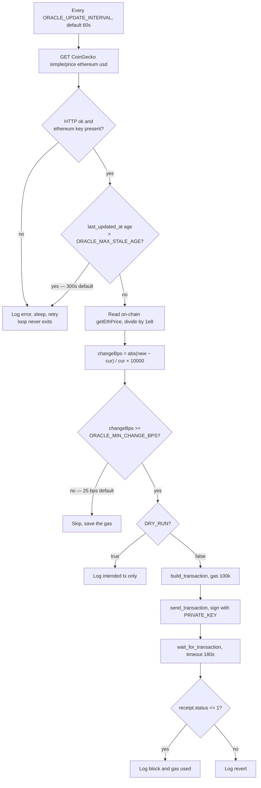

Three design details in that flow are worth copying into any keeper you write yourself. The staleness check rejects CoinGecko's own cached data rather than trusting the response blindly. The deadband means a flat market costs nothing to run. And every exception is caught inside the loop, so a transient network failure logs a line and retries instead of killing the process.

### settlement_keeper.py

Reads `SwapFactory.getActiveSwapIds()`, fetches each swap, and calls `SwapEngine.settleSwap(swapId)` for any where `now − lastSettlementTime >= settlementInterval`. Because settlement flows through `DvPEngine`, a swap either settles completely or not at all.

### liquidation_keeper.py

Polls `LoanManager.isLiquidatable(borrower)` across known borrowers and calls `liquidate` on any that return true. In a real deployment this is a competitive race; here it is a safety net so the protocol does not carry bad debt during a demo.

### scanner.py

Read-only. Dumps pool liquidity, utilisation, current rate, active swaps, and loan health to stdout. The fastest way to check whether a deployment is wired correctly without opening a browser.

---

## The frontend

Create React App with TypeScript, wagmi v2 and viem v2 for chain access, RainbowKit v2 for the wallet modal, Recharts for the charts, and a hand-written CSS theme built to read like a trading terminal — dense panels, 12px gutters, right-hand price axis, no wasted vertical space.

| Route | Page | What it does |
|---|---|---|
| `/` | Dashboard | ETH candles with a live oracle reference line, watchlist, alerts, loan health, the interest-rate curve, and pool composition |
| `/lend` | Lend | Deposit and withdraw USDC, with the two-step approval banner |
| `/borrow` | Borrow | Collateral and borrow sizing with a live LTV, health-factor and liquidation-price preview |
| `/hedge` | Swap | Open an interest-rate swap against a loan you own |
| `/marketplace` | Settle | Pending settlements and DvP execution |
| `/portfolio` | Portfolio | Your loans, swaps, and whether each loan is hedged |
| `/admin` | Admin | Governance parameters, rate-model curve, protocol totals |

`useProtocol` is the single data hook. It batches the reads every page needs, exposes `refetch` to the header refresh button, and owns the multi-step transaction state that drives the `Step 1 of 2` banner. `useWallet` wraps connection, the wrong-network warning and the Sepolia switch. `useEthOhlc` is the one hook that talks to something other than the chain.

### The two price numbers, and why they differ

The Dashboard shows a CoinGecko candle series and an on-chain oracle reference line, and they will not always agree. That is correct behaviour, not a bug: the oracle only updates when the price moves at least 25 bps, so the reference line lags spot slightly by design. The chart labels its own source at all times — `CoinGecko ETH/USD · live`, `loading market data…`, or `oracle-anchored simulation` — so it is always clear which one you are looking at.

---

## Getting started

### Prerequisites

- [Foundry](https://book.getfoundry.sh/getting-started/installation) — `forge` and `cast`
- Node.js 18 or newer
- Python 3.10 or newer
- A Sepolia RPC endpoint (Alchemy, Infura, or similar)
- A funded Sepolia deployer key
- A [WalletConnect project ID](https://cloud.walletconnect.com) for the wallet modal

### 1. Contracts

```bash
cd smart-contracts
forge install
forge build
forge test
```

Deploy and wire everything in one transaction batch:

```bash
export SEPOLIA_RPC_URL="https://eth-sepolia.g.alchemy.com/v2/YOUR_KEY"
export PRIVATE_KEY="0xyour_deployer_key"

forge script script/Deploy.s.sol:Deploy \
  --rpc-url "$SEPOLIA_RPC_URL" \
  --private-key "$PRIVATE_KEY" \
  --broadcast \
  -vvv
```

The script logs every deployed address at the end. Copy them — both the bots and the frontend need them, and **they must match**, or the UI and the keepers will operate on different deployments.

Note that `foundry.toml` sets `script = "ignore_scripts"`, so `forge build` does not compile the deploy script by default; `forge script` compiles it on demand. `via_ir = true` is required because several contracts exceed the stack limit without the IR pipeline, and it makes builds noticeably slower.

### 2. Keeper bots

```bash
cd bots
python -m venv venv
source venv/bin/activate        # Windows: venv\Scripts\activate
pip install -r requirements.txt
cp .env.example .env            # then fill in addresses
```

Always do a dry run first. With `DRY_RUN=true` the keepers log the transactions they *would* send without spending gas or touching state:

```bash
DRY_RUN=true python oracle_keeper.py
```

Check the protocol state without writing anything:

```bash
python scanner.py
```

Then run all three keepers under the supervisor:

```bash
python scheduler.py
```

Stop with `Ctrl+C` — the scheduler terminates each child, waits 10 seconds, and kills anything that has not exited.

### 3. Frontend

```bash
cd frontend
npm install
cp .env.example .env            # then fill in the same addresses
npm start
```

This is **Create React App, not Vite** — the dev command is `npm start`, not `npm run dev`. Production build is `npm run build`.

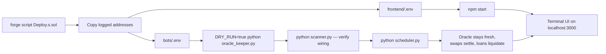

---

## Environment reference

### `bots/.env`

| Variable | Default | Purpose |
|---|---|---|
| `SEPOLIA_RPC_URL` | — | JSON-RPC endpoint |
| `PRIVATE_KEY` | — | Keeper signing key. Needs Sepolia ETH for gas |
| `CHAIN_ID` | `11155111` | Sepolia |
| `POLL_INTERVAL` | `30` | Supervisor and keeper loop cadence, seconds |
| `DRY_RUN` | — | `true` logs transactions without sending them |
| `COINGECKO_API_URL` | `.../simple/price` | Spot price endpoint |
| `COINGECKO_API_KEY` | — | Optional demo key, sent as `x-cg-demo-api-key` |
| `ORACLE_UPDATE_INTERVAL` | `60` | Seconds between oracle checks |
| `ORACLE_MIN_CHANGE_BPS` | `25` | Deadband — skip updates below 0.25% |
| `ORACLE_MAX_STALE_AGE` | `300` | Reject CoinGecko data older than this |
| Addresses | — | `LENDING_POOL`, `LOAN_MANAGER`, `COLLATERAL_VAULT`, `PRICE_ORACLE`, `MOCK_USDC_ADDRESS`, `LOAN_NFT`, `POSITION_REGISTRY`, `SWAP_FACTORY`, `SWAP_ENGINE`, `SETTLEMENT_ENGINE`, `NETTING_ENGINE`, `ESCROW_MANAGER`, `DVP_ENGINE`, `LIQUIDATION_ENGINE` |

Note the inconsistent naming: every address key is bare except `MOCK_USDC_ADDRESS`, which carries the suffix. That is what `config.py` reads, so keep it.

### `frontend/.env`

| Variable | Purpose |
|---|---|
| `REACT_APP_CHAIN_ID` | `11155111` |
| `REACT_APP_SEPOLIA_RPC_URL` | JSON-RPC endpoint for reads |
| `REACT_APP_WALLETCONNECT_PROJECT_ID` | RainbowKit / WalletConnect |
| `REACT_APP_MOCK_USDC` … `REACT_APP_LIQUIDATION_ENGINE` | The 16 contract addresses, including `REACT_APP_GOVERNANCE`, `REACT_APP_INTEREST_RATE_MODEL` and `REACT_APP_SWAP_NFT`, which the bots do not need |

`REACT_APP_COINGECKO_API_KEY` is read by the code but is intentionally **left unset**. Anything prefixed `REACT_APP_` is inlined into the JavaScript bundle at build time and is therefore public. The browser uses CoinGecko's keyless endpoint instead; the key belongs only in `bots/.env`, where it stays server-side.

---

## Testing

```bash
cd smart-contracts
forge test                      # all suites
forge test -vvv                 # with traces
forge test --match-path test/lending/*        # one domain
forge test --gas-report         # gas per function
forge coverage                  # coverage summary
```

Tests are organised by domain, mirroring `src/`: `lending`, `liquidation`, `swaps`, `settlement`, `tokenization`, `oracle`, `governance`, `mocks`, and `integration` for cross-contract paths.

---

## Troubleshooting and known API issues

### The chart says "oracle-anchored simulation" instead of live

This is the most common thing people report, and it is a designed fallback rather than a failure. `useEthOhlc` fetches `api.coingecko.com/api/v3/coins/ethereum/ohlc?vs_currency=usd&days=1` directly from the browser. Any of the following makes that call fail:

| Cause | What you see | Why |
|---|---|---|
| **HTTP 429** | `CoinGecko HTTP 429` in the console | The keyless public tier allows roughly 10–30 calls per minute *per IP*. React 18+ StrictMode mounts effects twice in development, and if the keeper bot is polling from the same network it shares the quota |
| **CORS rejection** | Blocked by CORS policy | CoinGecko permits browser origins on the public endpoint, but a proxy, VPN, or corporate middlebox can strip the `Access-Control-Allow-Origin` header |
| **Offline or DNS failure** | `TypeError: Failed to fetch` | No network path |
| **Thin payload** | `empty OHLC payload` | Fewer than 5 candles returned, which happens occasionally right after a CoinGecko cache flush |

In every case the hook catches the exception, sets `status = "sim"`, and renders a deterministic candle series generated by `buildCandleSeries(fallbackPrice)`. That series is a seeded `mulberry32` random walk normalised so its **final close equals the live on-chain oracle price** — so the shape is synthetic, but the current price is real, and the label under the chart says so plainly. The panel never silently shows fake data as though it were live.

The fix, if you want live candles reliably: get a free CoinGecko demo key and put it in `bots/.env` as `COINGECKO_API_KEY`. For the browser, wait out the rate limit or run a small server-side proxy. **Do not** put the key in `frontend/.env` — `REACT_APP_*` variables are string-substituted into the production bundle at build time, so publishing the app would publish the key. The code reads `REACT_APP_COINGECKO_API_KEY` if present purely so a local developer can opt in knowingly; it is deliberately absent from the committed `.env`.

### The oracle keeper logs "CoinGecko price is stale"

The keeper compares `last_updated_at` from the response against `ORACLE_MAX_STALE_AGE` (300s) and refuses to push data older than that. This is intentional — pushing a stale price to an oracle that governs liquidations is worse than pushing nothing. It usually resolves itself within a minute or two.

**There is a real bug here worth knowing about.** `bots/.env` defines `ORACLE_MAX_STALENESS`, but `oracle_keeper.py` reads `ORACLE_MAX_STALE_AGE`. The names do not match, so whatever you configure in `.env` is silently ignored and the hard-coded default of 300 seconds is always used. Either rename the `.env` key to `ORACLE_MAX_STALE_AGE` or change the `os.getenv` call in `oracle_keeper.py` — but pick one, because right now the knob does nothing.

### Transactions revert or the UI shows stale numbers

Work down this list in order:

1. **Address mismatch.** Confirm every address in `frontend/.env` matches `bots/.env` and the deploy log. A UI pointed at an old deployment looks broken in confusing ways.
2. **Wiring skipped.** If `borrow` reverts, check that `LoanManager.setLendingPool` and `CollateralVault.transferOwnership` actually ran. `python scanner.py` surfaces this quickly.
3. **Wrong network.** The shell shows a `Wrong network` banner with a switch button. Reads use `REACT_APP_SEPOLIA_RPC_URL`; writes use the wallet's network.
4. **No allowance.** `deposit` needs an ERC-20 approval first. The UI handles this as a two-step flow, but a rejected first signature leaves the second unable to proceed.
5. **RPC rate limits.** Free Alchemy and Infura tiers throttle under a chatty UI plus three polling keepers. Symptoms are intermittent read failures and numbers that refuse to refresh. Raise `POLL_INTERVAL` or use a dedicated key for the bots.
6. **Insufficient gas.** The oracle keeper hard-codes `gas=100_000` for `setEthPrice`. That is comfortable for a single storage write, but any change to the oracle would need it raised.

### `forge build` fails on stack-too-deep

`via_ir = true` is already set in `foundry.toml` and is required, not optional. If you copy a contract out of this repo into a project without it, expect stack-too-deep errors on `openSwap` and `liquidate`.

### Development-tooling note

`npm run build` and a full `tsc --noEmit` on this project are memory- and time-hungry. When verifying changes in a constrained environment, transpiling individual modules with `ts.transpileModule` and asserting on runtime exports is a much faster signal than a whole-project typecheck.

---

## Known limitations

This is a Sepolia demonstration protocol built with mock tokens and a mock oracle. It has not been audited and should not hold real value. Beyond that general caveat, there are three specific things a reader deserves to know, because each one is a place where the code does something different from what it appears to do.

### 1. Governance parameters are not enforced on-chain

`Governance.sol` stores `collateralFactorBps = 7500`, `liquidationThresholdBps = 8000`, `liquidationBonusBps = 500`, `baseBorrowRateBps = 200`, `maxBorrowRateBps = 2000`, `settlementInterval = 30 days` and `protocolFeeBps = 100`, guarded by `GOVERNOR_ROLE`. A grep across `src/` for every one of those names confirms that **no other contract reads any of them.** The values that actually govern behaviour are hard-coded constants in `LoanManager`:

```solidity
uint256 public constant COLLATERAL_FACTOR_BPS = 7500;
uint256 public constant LIQUIDATION_THRESHOLD_BPS = 8000;
uint256 public constant LIQUIDATION_BONUS_BPS = 500;
```

The two happen to agree today, which is exactly what makes this dangerous: a governor can change the Governance copy, the Admin page will faithfully display the new number, and `borrow()` will keep enforcing 7500 regardless. Treat the Admin page as a display of intent, not of enforced policy. The same applies to `Pausable` — `whenNotPaused` is never applied to any function outside `Governance` itself, so pausing signals an intent to halt without halting anything — and to `KEEPER_ROLE`, which no contract checks, since the keepers authenticate simply by holding the owner key.

To make governance real, each parameter consumer would need to read from the registry instead of a constant. `LendingPool` already stores a `Governance` immutable and never calls it, so the plumbing is half there.

### 2. The liquidation bonus is always clamped to zero

`LoanManager.liquidate` computes the seizure amount and then applies a safety clamp:

```solidity
uint256 collateralToLiquidator = debtInEth + bonus;
if (collateralToLiquidator > collateral) {
    collateralToLiquidator = collateral;
}
```

The intent is to prevent seizing more collateral than exists. But liquidation only becomes possible once the health factor drops below 1.0, which by definition means `debtInEth` has already grown to at least 80% of the collateral — and `debtInEth + 5%` therefore exceeds the collateral in essentially every reachable state. The clamp fires, the liquidator receives exactly the collateral, and the 5% bonus is never paid. In production this would mean no economic incentive to liquidate, and the protocol would rely entirely on its own keeper. A correct implementation would cap the *bonus* at the available surplus rather than clamping the total, and would liquidate a fraction of the position rather than all of it.

### 3. Other gaps

Interest is simple rather than compounding, which understates the true cost of a long-lived loan relative to how real money markets work. Liquidations are all-or-nothing, where mature protocols close only enough of a position to restore health. `MockPriceOracle` is a single owner-writable value with no multi-source aggregation, no deviation circuit breaker, and no on-chain staleness check, so the oracle keeper's key is a total-compromise point. `oracle/PriceOracle.sol` is a 10-line stub with a completely unguarded `updatePrice` — it is not deployed or wired anywhere, but it should be deleted rather than left in `src/` where someone might wire it up by mistake. And `NettingEngine` collapses pending settlements for a single swap only; netting across a user's whole book, which is where netting earns its keep in real derivatives clearing, is not implemented.

---

## License

MIT.


